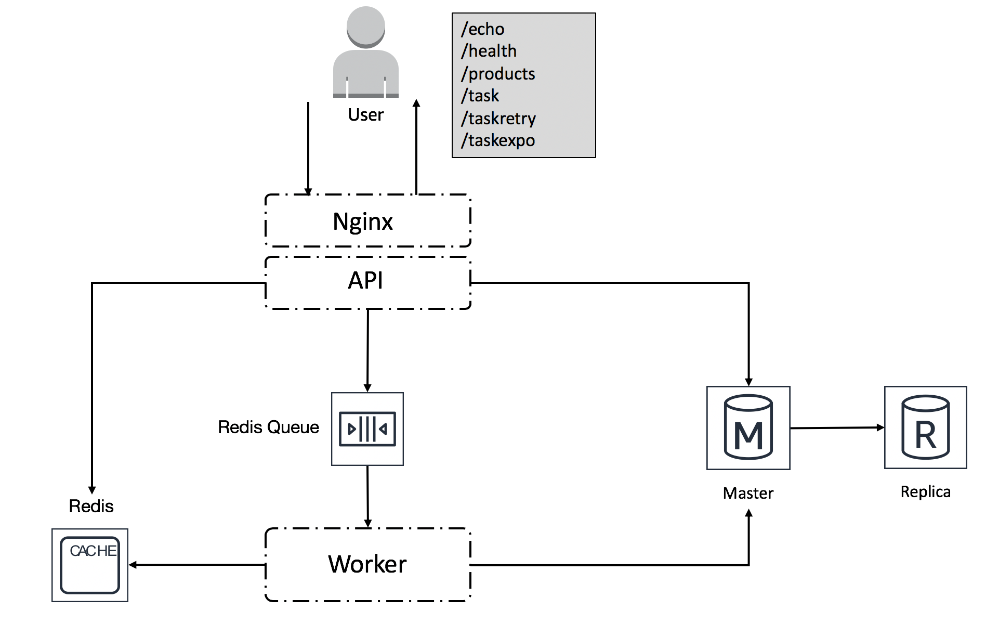

# Eleanor

Eleanor is an application developed in Python using the Flask framework. I use this application as demo for several of my talks on patterns for resiliency and chaos engineering. 



**Prerequisites**:

To use and run Eleanor, you need to have docker installed locally. The application is built using docker-compose.

You also need a python virtual environment in which you have installed all the `/eleanor_project/elanor/requirements.txt`

For python virtual environments, I use `pyenv`

```bash
> pyenv virtualenv eleanor
(eleanor) > pip install -r requirements.txt
```

To run the application, open a terminal in you local machine (Mac, Linux or Windows) and run `docker-compose up` this will built and run a set of  docker containers found in `/elanor_project/docker-compose.yml`.

```bash
> cd eleanor_project
> docker-compose up 
```

Once the application is built and runs (this may take a while when you do it for the first time), you need to initialise the database. 
To do that, open another terminal and run:  

```bash
> docker-compose run eleanor-api python3 create_db.py
```

Now you can start testing a few of the available APIs

**Testing the Health-Check APIs**

Health-Check APIs are located in `eleanor_project/eleanor/eleanor/api/echo_api.py`.

**shallow health-check**

```bash
(eleanor) ❯ http get http://127.0.0.1:80/api/echo

HTTP/1.1 200 OK
Connection: keep-alive
Content-Length: 31
Content-Type: application/json
Date: Tue, 11 Feb 2020 14:07:45 GMT
Server: nginx/1.15.9

{
    "Status": "Up and running..."
}
```

**Deep health check**

This health check supports Caching - hit it several times in a row, the content is served from the cache - preserving resources.

```bash
(eleanor) ❯ http get http://127.0.0.1:80/api/health
HTTP/1.1 200 OK
Connection: keep-alive
Content-Length: 591
Content-Type: text/html; charset=utf-8
Date: Tue, 11 Feb 2020 14:24:36 GMT
Retry-After: 30
Server: nginx/1.15.9

{
    "hostname": "172.17.0.7",
    "results": [
        {
            "checker": "db_master_check",
            "expires": 1581431091.6889544,
            "output": "db master ok",
            "passed": true,
            "timestamp": 1581431076.6889544
        },
        {
            "checker": "db_slave_check",
            "expires": 1581431091.714212,
            "output": "db slave ok",
            "passed": true,
            "timestamp": 1581431076.714212
        },
        {
            "checker": "redis_check",
            "expires": 1581431091.7156985,
            "output": "redis ok",
            "passed": true,
            "timestamp": 1581431076.7156985
        },
        {
            "checker": "task_check",
            "expires": 1581431091.7904391,
            "output": "tasks ok",
            "passed": true,
            "timestamp": 1581431076.7904391
        }
    ],
    "status": "success"
}
```

**Testing the Product APIs**

To POST a product in the databases

```bash
(eleanor) ❯ http post http://127.0.0.1:80/api/product Content-Type:application/json product_type="consumer good" price="368.00" product_name="Apple Iphone "
HTTP/1.1 200 OK
Connection: keep-alive
Content-Length: 71
Content-Type: application/json
Date: Thu, 13 Feb 2020 06:48:17 GMT
Server: nginx/1.15.9

{
    "product_id": "b202c4cf32d54052b21eec254af141bd",
    "status": "success"
}

```

To GET a product from the databases

```bash
(eleanor) ❯ http get http://127.0.0.1:80/api/product/b202c4cf32d54052b21eec254af141bd
HTTP/1.1 200 OK
Connection: keep-alive
Content-Length: 167
Content-Type: application/json
Date: Thu, 13 Feb 2020 06:49:36 GMT
Server: nginx/1.15.9

{
    "id": "b202c4cf32d54052b21eec254af141bd",
    "price": "368.00",
    "product_name": "Apple Iphone ",
    "product_type": "consumer good",
    "timestamp": "2020-02-13 06:48:17.000"
}

```

**Testing the Task APIs**


Normal one. Uses asynchronous pattern to put a job (successful)

```bash
(eleanor) ❯ http put http://127.0.0.1:80/api/task
HTTP/1.1 200 OK
Connection: keep-alive
Content-Length: 51
Content-Type: application/json
Date: Thu, 13 Feb 2020 06:52:31 GMT
Server: nginx/1.15.9

{
    "Task ID": "54fc3014-296f-4a29-bd28-1bc64d05128d"
}
```

to GET the result of the task

```bash
(eleanor) ❯ http get http://127.0.0.1:80/api/task/54fc3014-296f-4a29-bd28-1bc64d05128d
HTTP/1.1 200 OK
Connection: keep-alive
Content-Length: 59
Content-Type: application/json
Date: Thu, 13 Feb 2020 06:53:43 GMT
Server: nginx/1.15.9

{
    "54fc3014-296f-4a29-bd28-1bc64d05128d": [
        "SUCCESS",
        "40"
    ]
}
```

PUT a Task with retries every 1s (dangerous)

```bash
(eleanor) ❯ http put http://127.0.0.1:80/api/taskretry
HTTP/1.1 200 OK
Connection: keep-alive
Content-Length: 51
Content-Type: application/json
Date: Thu, 13 Feb 2020 06:56:22 GMT
Server: nginx/1.15.9

{
    "Task ID": "b2ed4368-523c-4d24-8007-6f9bc8aaf492"
}

```

That example is a failed task to force retry, so if you get the result, it is failed. 

```bash
(eleanor) ❯ http get http://127.0.0.1:80/api/task/b2ed4368-523c-4d24-8007-6f9bc8aaf492
HTTP/1.1 200 OK
Connection: keep-alive
Content-Length: 84
Content-Type: application/json
Date: Thu, 13 Feb 2020 06:56:49 GMT
Server: nginx/1.15.9

{
    "b2ed4368-523c-4d24-8007-6f9bc8aaf492": [
        "FAILURE",
        "empty range for randrange()"
    ]
}
```
You can see in the logs that the task is retired every second.

```bash
eleanor-tasks_1  | [2020-02-13 15:18:01,874: INFO/MainProcess] Task eleanor.celery.tasks.add_retry[349e045f-cefe-48d6-96b7-6f914f818b88] retry: Retry in 1s: ValueError('empty range for randrange()',)
...
eleanor-tasks_1  | [2020-02-13 15:18:01,874: INFO/MainProcess] Task eleanor.celery.tasks.add_retry[349e045f-cefe-48d6-96b7-6f914f818b88] retry: Retry in 1s: ValueError('empty range for randrange()',)
...
eleanor-tasks_1  | [2020-02-13 15:18:01,874: INFO/MainProcess] Task eleanor.celery.tasks.add_retry[349e045f-cefe-48d6-96b7-6f914f818b88] retry: Retry in 1s: ValueError('empty range for randrange()',)
...
eleanor-tasks_1  | [2020-02-13 15:18:01,874: INFO/MainProcess] Task eleanor.celery.tasks.add_retry[349e045f-cefe-48d6-96b7-6f914f818b88] retry: Retry in 1s: ValueError('empty range for randrange()',)
```


TO PUT a Task with exponantial backoff retries, with Jitter (recommended practice)

```bash
(eleanor) ❯ http put http://127.0.0.1:80/api/taskexpo
HTTP/1.1 200 OK
Connection: keep-alive
Content-Length: 51
Content-Type: application/json
Date: Thu, 13 Feb 2020 07:00:12 GMT
Server: nginx/1.15.9

{
    "Task ID": "a16067ec-5b33-4435-903f-a72f4b3db840"
}

```
You can see in the logs that the task is retired with an expo backoff with Jitter

```bash
eleanor-tasks_1  | [2020-02-13 10:44:42,911: INFO/MainProcess] Task eleanor.celery.tasks.add[26a1c4fd-db90-475a-a1d2-005ae176162b] retry: Retry in 1s: ValueError('empty range for randrange()',)
...
eleanor-tasks_1  | [2020-02-13 10:44:43,879: INFO/MainProcess] Task eleanor.celery.tasks.add[26a1c4fd-db90-475a-a1d2-005ae176162b] retry: Retry in 2s: ValueError('empty range for randrange()',)
...
eleanor-tasks_1  | [2020-02-13 10:44:45,882: INFO/MainProcess] Task eleanor.celery.tasks.add[26a1c4fd-db90-475a-a1d2-005ae176162b] retry: Retry in 5s: ValueError('empty range for randrange()',)
...
eleanor-tasks_1  | [2020-02-13 10:44:50,888: INFO/MainProcess] Task eleanor.celery.tasks.add[26a1c4fd-db90-475a-a1d2-005ae176162b] retry: Retry in 12s: ValueError('empty range for randrange()',)
...
eleanor-tasks_1  | [2020-02-13 10:45:02,893: INFO/MainProcess] Task eleanor.celery.tasks.add[26a1c4fd-db90-475a-a1d2-005ae176162b] retry: Retry in 96s: ValueError('empty range for randrange()',)
```

If everything above works - all is fine!